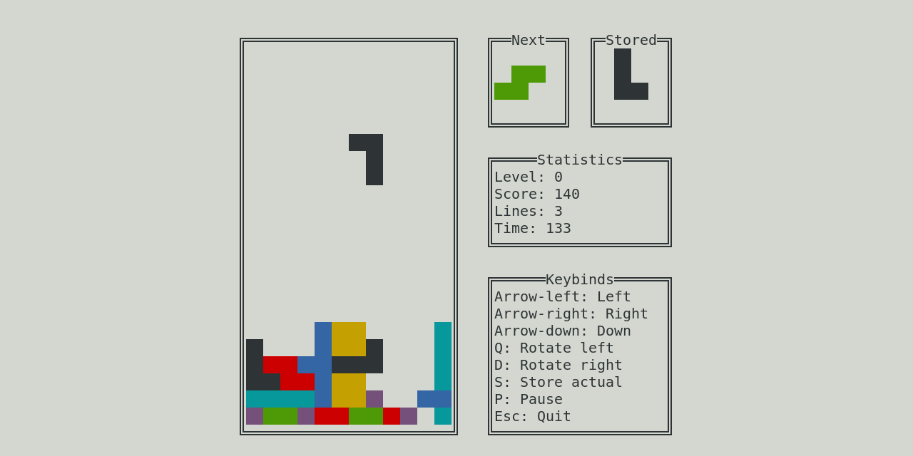

# Tertris
Terminal-based clone of the [Tetris' NES version](https://tetris.wiki/Tetris_(NES,_Nintendo)).

## LOOK:

## HOW TO USE IT ?
1. Download the project
2. Set the window's size of your terminal at least 53x25 characters (otherwise the board game will not be able to be printed correctly)
3. Run `Tertris.py` with Python3 from a terminal (`python3 Tertris.py` when your current directory is this game)
4. Enjoy :)

## LANGUAGE:
- User interface and code are in english.
- Comments are only in french for the time being (maybe an english version will come later).

## DISCLAIMERS
- Tertris uses the [curses library](https://en.wikipedia.org/wiki/Curses_(programming_library)) for Python 3 to print it interface, so **it can only run in Unix-based OS**.
- Tertris is still in progress, so some features (such as level counting) may not being implemented.
- Since in the Python 3's version of the curses module the class `_CursesWindow` is private, I had to declare them as objects. In result, your IDE will cry blood if you open `View.py`. 

## OTHER LINKS:
- The [official Tetris website](https://tetris.com/).
- The [Wikipedia's page of the Tetris' guideline](https://tetris.wiki/Tetris_Guideline) that I will try to follow (this is only partially the case now).
- The [curses how to use guide](https://docs.python.org/3/howto/curses.html) I used.
- The [official GitHub page of Tertris](https://github.com/vmom/tertris).

